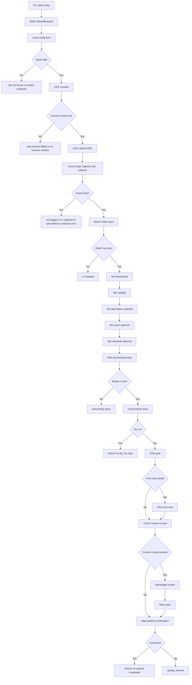
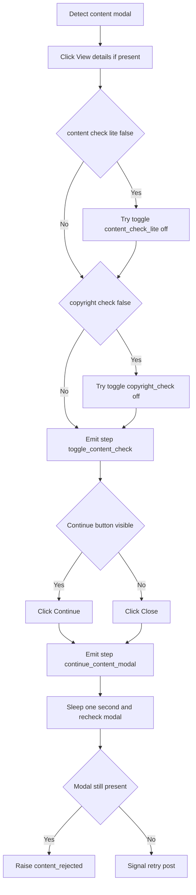
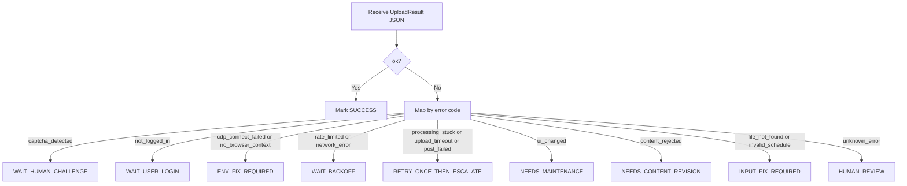
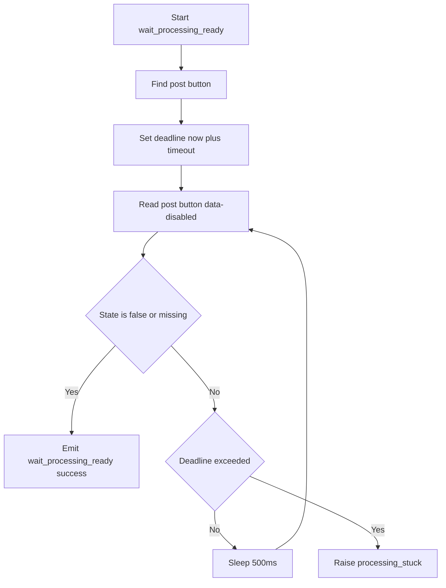

# Mermaid Flows

## 1) End-to-end upload flow

```mermaid
flowchart TD
    A[CLI parse args] --> B[Build UploadRequest]
    B --> C["Load config toml"]
    C --> D{Input valid}
    D -- No --> D1[file not found or invalid schedule]
    D -- Yes --> E[CDP connect]
    E --> F{Connect context ok}
    F -- No --> F1[cdp connect failed or no browser context]
    F -- Yes --> G[Goto upload URL]
    G --> H[Guard login captcha rate network]
    H --> I{Guard clean}
    I -- No --> I1[not logged in or captcha or rate limited or network error]
    I -- Yes --> J[Attach video input]
    J --> K{Attach success}
    K -- No --> K1[ui changed]
    K -- Yes --> N[Set interactivity]
    N --> O[Set visibility]
    O --> P[Set description optional]
    P --> Q[Set cover optional]
    Q --> R[Set schedule optional]
    R --> L[Wait processing ready]
    L --> M{Ready in time}
    M -- No --> M1[processing stuck]
    M -- Yes --> S[Guard before post]
    S --> T{Dry run}
    T -- Yes --> T1[Return ok dry run stop]
    T -- No --> U[Click post]
    U --> V{Post now modal}
    V -- Yes --> V1[Click post now]
    V -- No --> W[Check content modal]
    V1 --> W
    W --> X{Content modal present}
    X -- No --> Y[Wait publish confirmation]
    X -- Yes --> Z[Remediate modal]
    Z --> Z1[Retry post]
    Z1 --> Y
    Y --> Y1{Confirmed}
    Y1 -- Yes --> OK[Return ok upload completed]
    Y1 -- No --> ETO[upload_timeout]
```

## 2) Content restriction remediation sub-flow

```mermaid
flowchart TD
    A[Detect content modal] --> B[Click View details if present]
    B --> C{content check lite false}
    C -- Yes --> C1[Try toggle content_check_lite off]
    C -- No --> D
    C1 --> D{copyright check false}
    D -- Yes --> D1[Try toggle copyright_check off]
    D -- No --> E
    D1 --> E[Emit step toggle_content_check]
    E --> F{Continue button visible}
    F -- Yes --> F1[Click Continue]
    F -- No --> F2[Click Close]
    F1 --> G[Emit step continue_content_modal]
    F2 --> G
    G --> H["Sleep one second and recheck modal"]
    H --> I{Modal still present}
    I -- Yes --> I1[Raise content_rejected]
    I -- No --> J[Signal retry post]
```

## 3) OpenClaw retry/fallback state machine

```mermaid
flowchart TD
    A[Receive UploadResult JSON] --> B{ok?}
    B -- Yes --> S1[Mark SUCCESS]
    B -- No --> C[Map by error code]

    C -->|captcha_detected| H1[WAIT_HUMAN_CHALLENGE]
    C -->|not_logged_in| H2[WAIT_USER_LOGIN]
    C -->|cdp_connect_failed or no_browser_context| H3[ENV_FIX_REQUIRED]
    C -->|rate_limited or network_error| H4[WAIT_BACKOFF]
    C -->|processing_stuck or upload_timeout or post_failed| H5[RETRY_ONCE_THEN_ESCALATE]
    C -->|ui_changed| H6[NEEDS_MAINTENANCE]
    C -->|content_rejected| H7[NEEDS_CONTENT_REVISION]
    C -->|file_not_found or invalid_schedule| H8[INPUT_FIX_REQUIRED]
    C -->|unknown_error| H9[HUMAN_REVIEW]
```

## 4) Wait processing ready check loop

```mermaid
flowchart TD
    A[Start wait_processing_ready] --> B[Find post button]
    B --> C[Set deadline now plus timeout]
    C --> D[Read post button data-disabled]
    D --> E{State is false or missing}
    E -- Yes --> F[Emit wait_processing_ready success]
    E -- No --> G{Deadline exceeded}
    G -- No --> H[Sleep 500ms]
    H --> D
    G -- Yes --> I[Raise processing_stuck]
```
